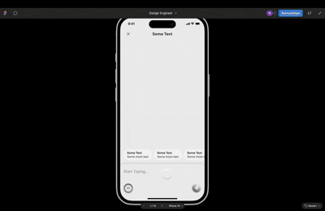

  

# 🐣 Hatchat – iOS Design Engineer Assignment

A UIKit-based messaging UI featuring dynamic interactions, smooth animations, and a polished experience—reminiscent of Slack or iMessage.

### 📹 Hatch Design

### 📹 My Implementation

---

### ✨ Features

- 🪟 Bottom sheet with real-time drag gestures
- 📝 Multiline text input with dynamic font resizing
- 🔼 Expand/minimize sheet with animated transitions
- 💬 Scrollable chip selector above the input field
- 📷 Tap to insert image thumbnail below text input
- 🌗 Supports dark mode seamlessly

---

### ✨ TODO

🔧 Replace FittedSheets library with a custom implementation
For the sake of time and clarity during the interview phase, I utilized the FittedSheets library to quickly prototype and demonstrate complex bottom sheet behavior.
In a production setting, this should be replaced with a fully custom UIKit-driven sheet to gain more control over animations, layering, and interaction.

### ✨ Feedback

⚠️ UX deviation from standard input behavior
The current dynamic font resizing for the text input was implemented based on specific instructions from Hatchat’s design team.
While this behavior works technically, a more conventional UX pattern would be to use a growing UITextView that expands with content instead of dynamically changing font sizes. This approach is more familiar and intuitive for users, and avoids visual jumps in text size.

